# My-Medi Flow Documentation

## 프로젝트 개요
My-Medi는 질환·약 정보를 쉽게 이해하고, 매일의 개인 복약을 기록·관리할 수 있는 AI 기반 복약 관리 웹 서비스입니다.

---

## 1. 전체 서비스 아키텍처

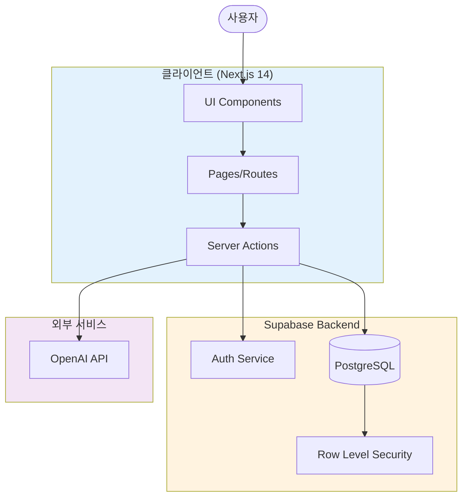

---

## 2. 사용자 인증 플로우

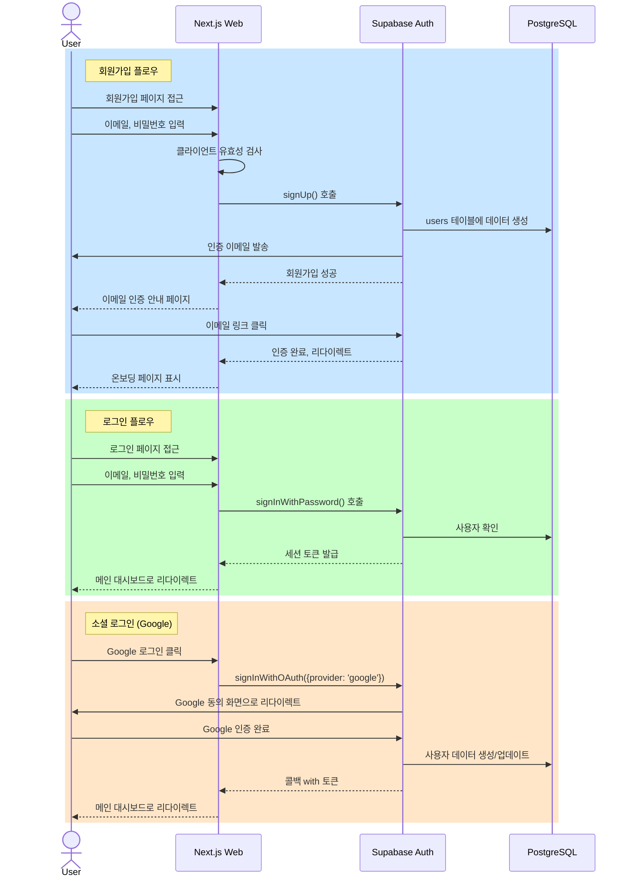

---

## 3. 메인 대시보드 플로우 (오늘 복약 관리)

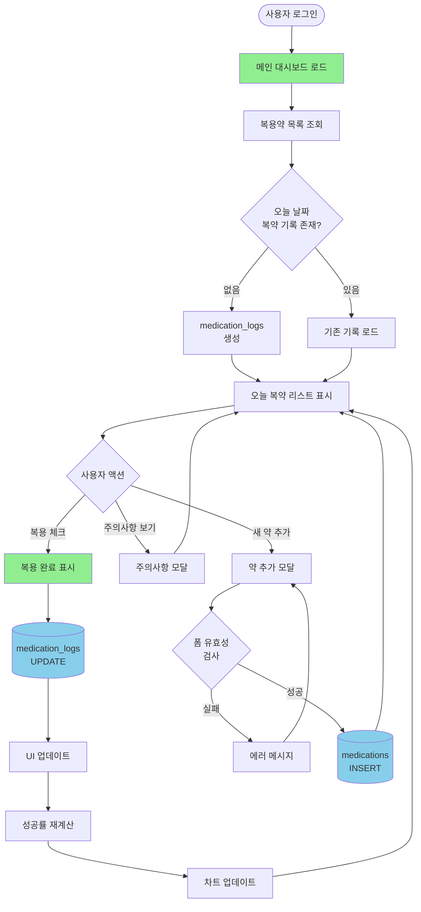

---

## 4. 질환·약 정보 탐색 및 AI 설명 플로우

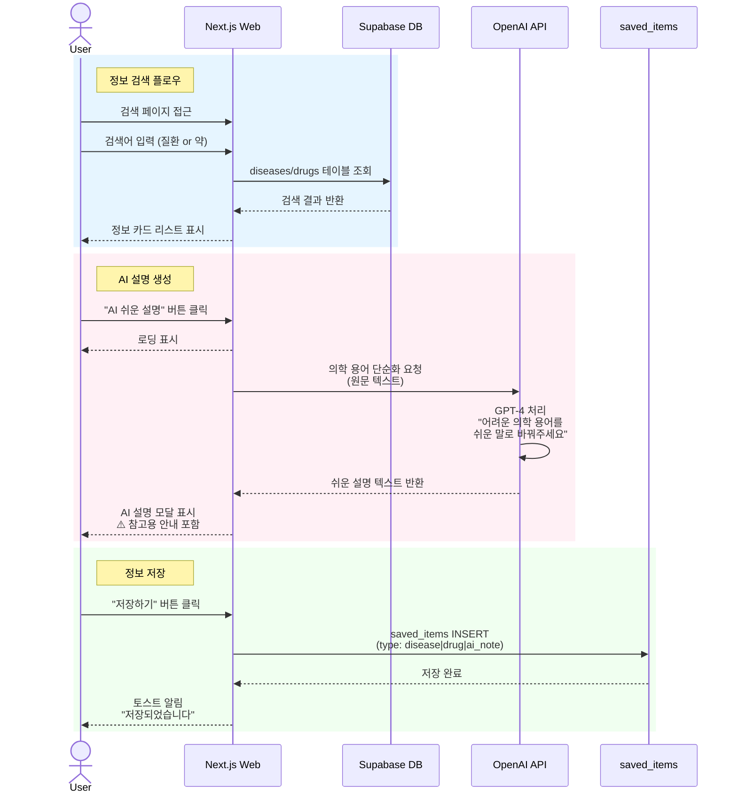

---

## 5. 복약 이력 조회 및 시각화 플로우

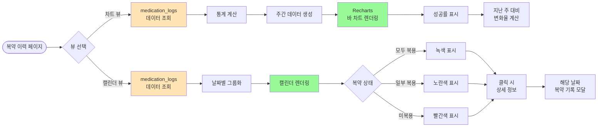

---

## 6. 마이페이지 플로우

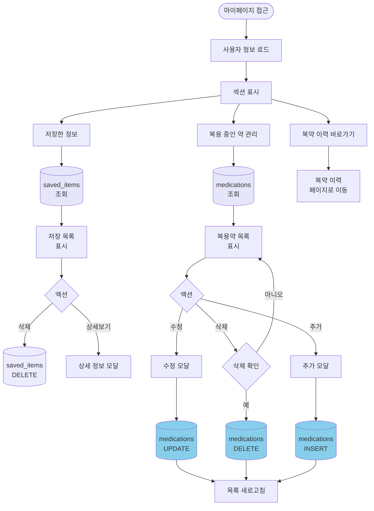

---

## 7. 데이터베이스 ERD

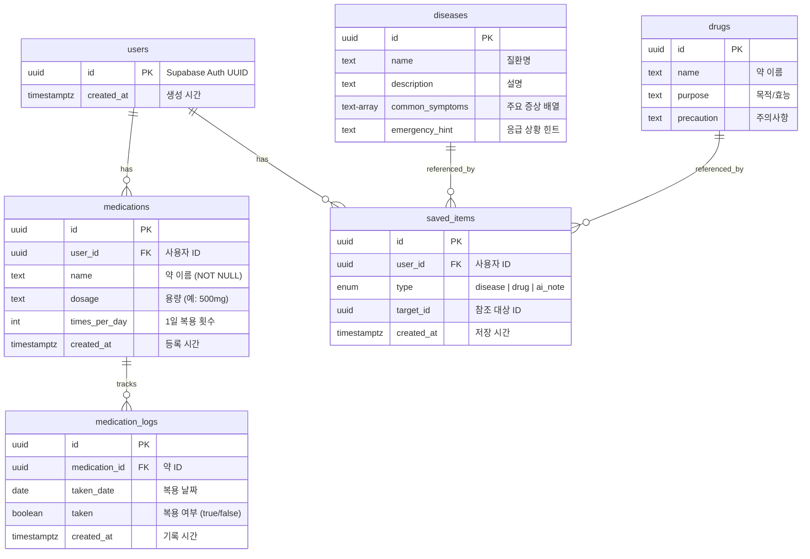

---

## 8. 온보딩 플로우 (신규 사용자)

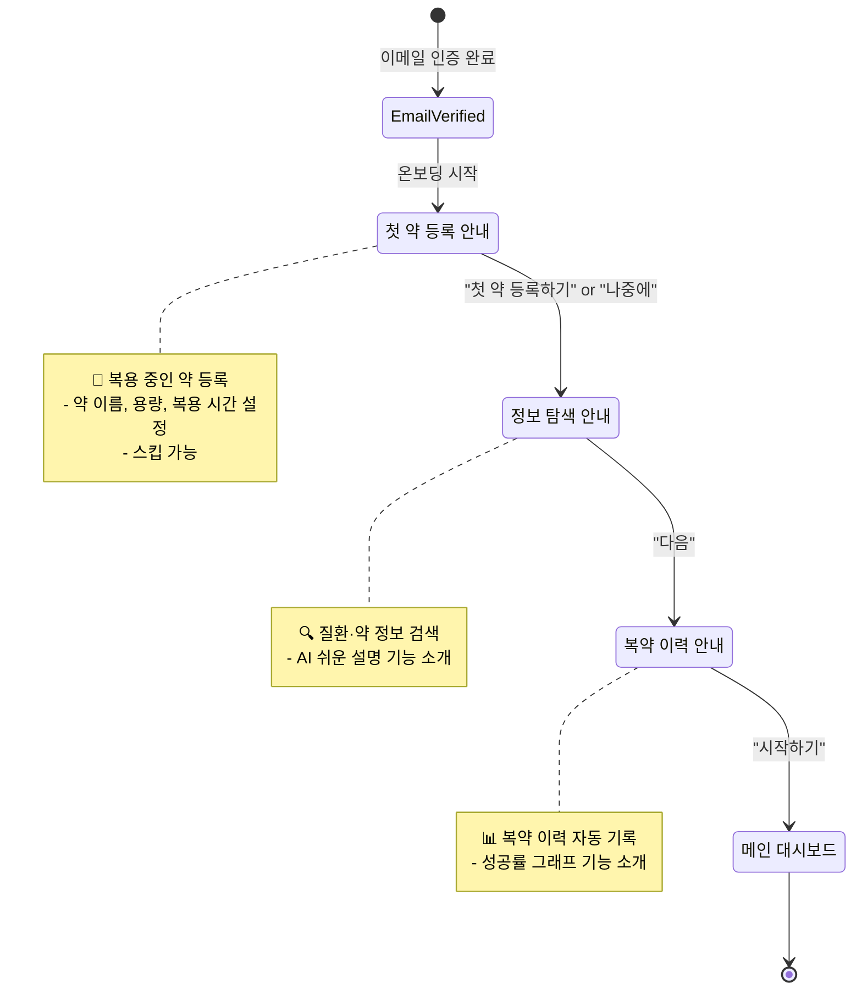

---

## 9. AI 처리 플로우 (의학 용어 단순화)

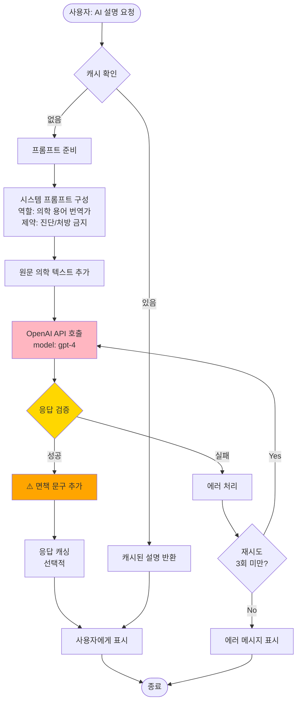

---

## 10. RLS (Row Level Security) 정책 플로우

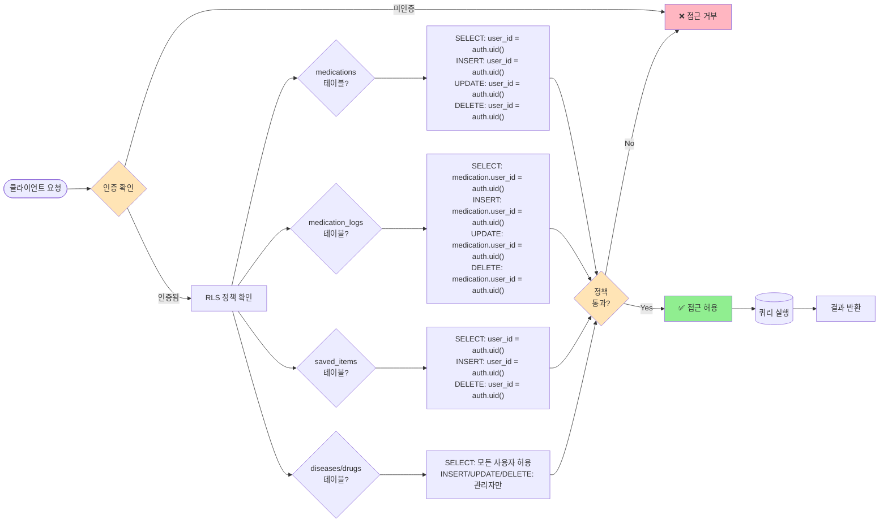

---

## 11. 에러 핸들링 플로우

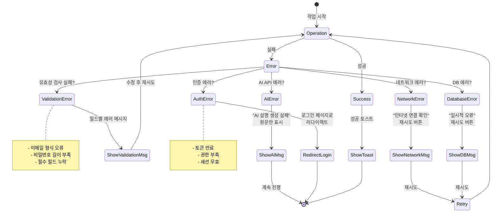

---

## 12. 상태 관리 플로우

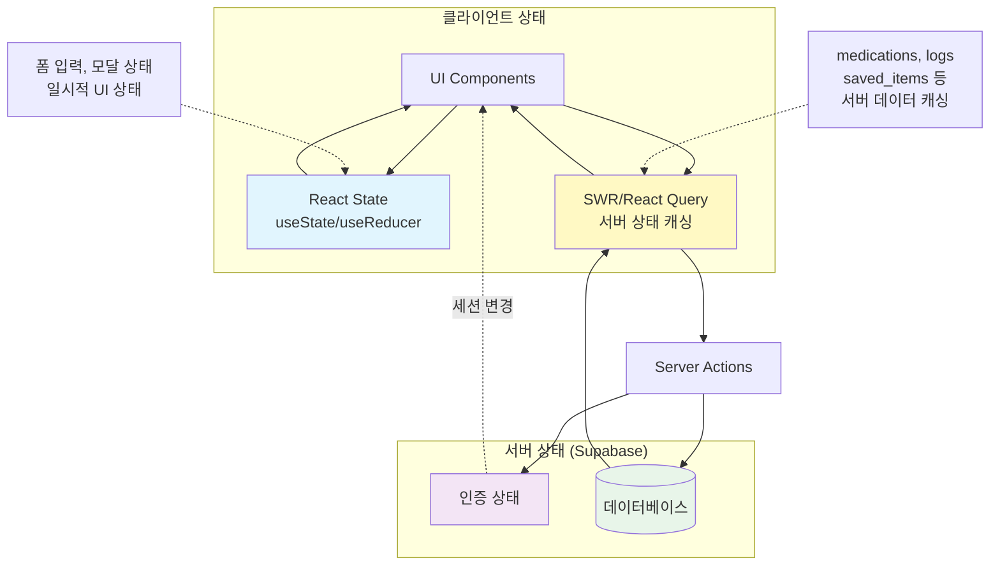

---

## 13. 배포 및 CI/CD 플로우

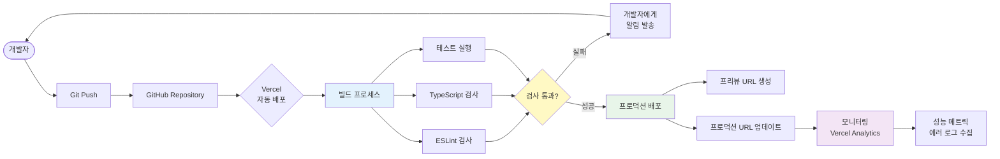

---

## 14. Success Metrics 달성 플로우

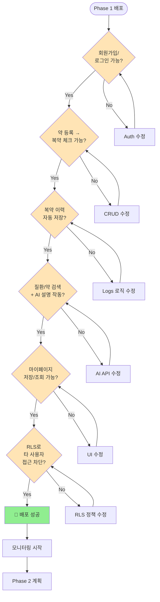

---

## 15. Phase 1 vs Phase 2 구분

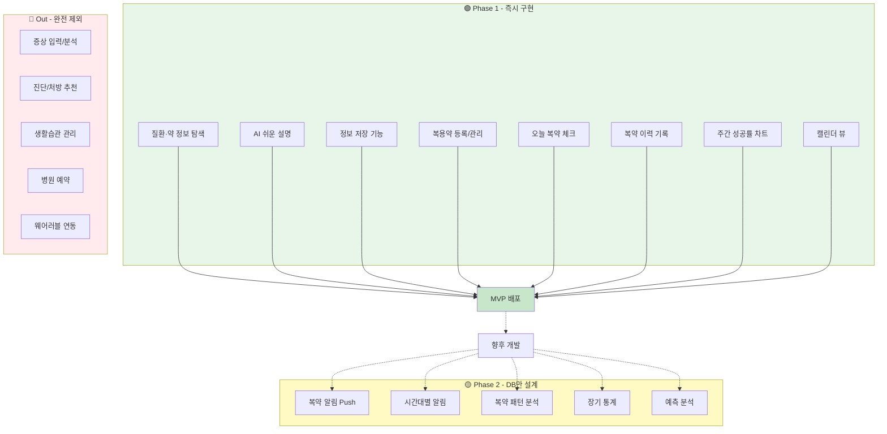

---

## 16. 기술 스택 의존성 다이어그램

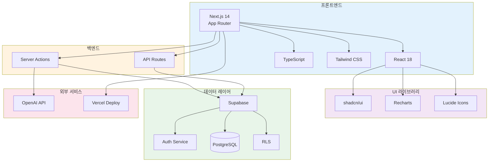

---

## 17. 실시간 업데이트 플로우 (선택적)

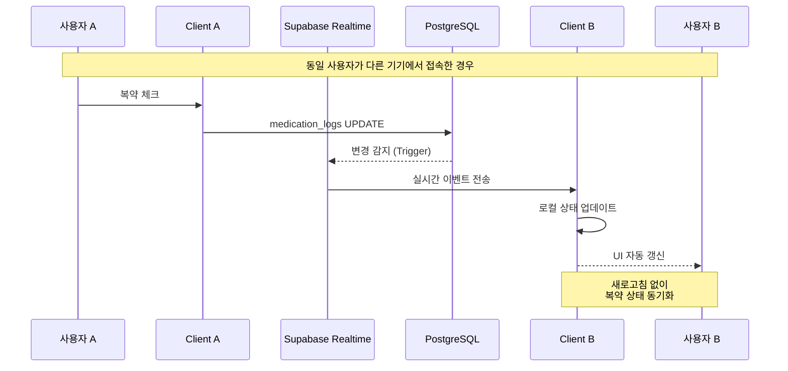

---

## 주요 의사결정 기록

### ✅ 채택한 것
1. **Next.js App Router**: 최신 패턴, Server Actions 활용
2. **Supabase**: All-in-one (Auth + DB + RLS)
3. **OpenAI API**: 의학 용어 단순화 전용
4. **Recharts**: 간단한 차트 라이브러리
5. **Tailwind CSS**: 빠른 개발, 일관된 디자인

### ❌ 제외한 것
1. **Redux/Zustand**: 과도한 상태관리 (Server Actions로 충분)
2. **tRPC**: 타입 안정성은 좋으나 학습곡선 고려
3. **Prisma**: Supabase SDK로 충분
4. **PWA**: Phase 1에서는 불필요
5. **WebSocket**: Realtime은 Phase 2로 연기

### 🎯 핵심 원칙
- **KISS (Keep It Simple, Stupid)**
- **YAGNI (You Aren't Gonna Need It)**
- **Phase 1 = MVP (Minimum Viable Product)**

---

## 다음 단계

1. ✅ ERD 최종 확정
2. ✅ Supabase 프로젝트 생성
3. ✅ Next.js 프로젝트 초기화
4. ⏳ 인증 플로우 구현
5. ⏳ 메인 대시보드 구현
6. ⏳ AI 통합
7. ⏳ 배포 및 테스트

---

**작성일**: 2026-02-04  
**버전**: 1.0  
**작성자**: My-Medi 개발팀
